# NexaBank Route Map

This map describes the Next.js frontend routes under `NexaBank/frontend/app`. Route groups such as `(auth)` and `(dashboard)` do not appear in the browser URL.

NexaBank has two distinct route spaces:

- **Frontend pages** run on the Next.js app, normally `http://localhost:3002`. These are browser destinations such as `/loans`.
- **Backend API routes** run on the Express app, normally `http://localhost:5000`. These are HTTP endpoints prefixed with `/api`, such as `GET /api/loans`.

The same suffix can appear in both spaces without meaning the same route. For example, frontend `/loans` is a page, while backend `GET /api/loans` returns loan data.

## Route graph

```mermaid
flowchart TD
    HOME["/ Home"]
    LOGIN["/login"]
    REGISTER["/register"]
    OTP["/verify-otp"]
    DETAILS["/details"]
    DASH["/dashboard"]
    ACCOUNTS["/accounts"]
    TX["/transactions"]
    PAYEES["/payees"]
    LOANS["/loans"]
    PROFILE["/profile"]
    PRO["/pro-feature?id=..."]
    ADMIN_LOANS["/admin/loans"]
    ADMIN_TOGGLES["/admin/feature-toggles"]
    ADMIN_SIMULATE["/admin/simulate"]
    ANALYTICS["Analytics dashboard\n(external :3001)"]

    HOME -->|Sign in| LOGIN
    HOME -->|Get started| REGISTER
    HOME -->|Authenticated user| DASH

    LOGIN -->|Sign up| REGISTER
    LOGIN -->|Successful login| DASH
    REGISTER -->|Sign in link| LOGIN
    DETAILS -->|Account details submitted| DASH
    OTP -->|Verification complete| LOGIN
    OTP -->|Back to sign in| LOGIN
    OTP -.->|Resend link currently targets missing route| FORGOT["/forgot-password\n(not implemented)"]

    DASH --> ACCOUNTS
    DASH --> TX
    ACCOUNTS -->|Shared navigation| DASH
    ACCOUNTS --> TX
    TX -->|Shared navigation| DASH
    TX --> ACCOUNTS
    PAYEES -->|Shared navigation| DASH
    PAYEES --> ACCOUNTS
    PAYEES --> TX
    LOANS -->|Shared navigation| DASH
    LOANS --> ACCOUNTS
    LOANS --> TX
    PROFILE -->|Shared navigation| DASH
    PROFILE --> ACCOUNTS
    PROFILE --> TX
    PRO -->|Shared navigation| DASH
    PRO --> ACCOUNTS
    PRO --> TX

    PROFILE -->|Admin menu| ADMIN_LOANS
    PROFILE -->|Admin menu| ADMIN_TOGGLES
    PROFILE -->|Admin menu| ADMIN_SIMULATE
    ADMIN_LOANS -->|Non-admin guard| DASH
    ADMIN_TOGGLES -->|Non-admin guard| DASH
    ADMIN_SIMULATE -->|Non-admin guard| DASH
    PROFILE -->|Admin menu| ANALYTICS

    UNAUTH["Any protected route\nwhile signed out"] --> LOGIN
    AUTH["/login or /register\nwhile signed in"] --> DASH
```

## Page-by-page destinations

| Current page | Can go to | How | Access and notes |
|---|---|---|---|
| `/` | `/login`, `/register`, `/dashboard` | Sign In, Get Started, or the authenticated-user CTA | Public landing page. The dashboard CTA is shown only when authentication is loaded and true. |
| `/login` | `/register`, `/dashboard` | Sign up link; successful login | Public auth page. The global guard redirects an already signed-in user to `/dashboard`. |
| `/register` | `/login`, `/dashboard` | Sign in link; registration completion in `Register3` | Public auth page. No implemented link currently enters `/details`; an already signed-in user is redirected to `/dashboard`. |
| `/details` | `/login`, `/dashboard` | Sign in link; details form submission | Standalone details screen with no implemented inbound navigation. Its form currently simulates submission and then routes to `/dashboard`. |
| `/verify-otp` | `/login`, `/forgot-password` | Back to sign in; Resend link | Standalone verification screen with no implemented inbound navigation. The verification submit handler routes to `/login`. `/forgot-password` has no matching page in the frontend route tree. Because `/verify-otp` is not in the global public-path list, signed-out direct access is redirected to `/login`. |
| `/dashboard` | `/accounts`, `/transactions`, all shared navigation pages | Make a Transfer, Manage Accounts, View all transactions, navbar/sidebar | Requires authentication. |
| `/accounts` | `/dashboard`, `/accounts`, `/transactions`, `/payees`, `/loans`, `/profile`, `/pro-feature?id=...`, `/login` | Shared navbar/sidebar; sidebar Logout link | Requires authentication. The page itself redirects to `/login` if auth is absent. |
| `/transactions` | `/dashboard`, `/accounts`, `/transactions`, `/payees`, `/loans`, `/profile`, `/pro-feature?id=...`, `/login` | Shared navbar/sidebar; sidebar Logout link | Pagination stays on the same page and is not a route transition. |
| `/payees` | `/dashboard`, `/accounts`, `/transactions`, `/payees`, `/loans`, `/profile`, `/pro-feature?id=...`, `/login` | Shared navbar/sidebar; sidebar Logout link | Requires authentication. Payee actions are in-page actions. |
| `/loans` | `/dashboard`, `/accounts`, `/transactions`, `/payees`, `/loans`, `/profile`, `/pro-feature?id=...`, `/login` | Shared navbar/sidebar; sidebar Logout link | Requires authentication. Loan application and KYC steps are in-page state, not separate routes. |
| `/profile` | `/dashboard`, `/accounts`, `/transactions`, `/payees`, `/loans`, `/profile`, `/pro-feature?id=...`, `/login`, admin routes, external analytics | Shared navbar/sidebar, user menu, admin menu, Sign out | Requires authentication. Admin menu is visible only for `role === "ADMIN"`. |
| `/pro-feature?id=ai-insights` | Same shared navigation destinations | Shared navbar/sidebar | The same page handles `ai-insights`, `crypto-trading`, `wealth-management-pro`, and `bulk-payroll-processing` through the `id` query parameter. |
| `/pro-feature?id=crypto-trading` | Same shared navigation destinations | Shared navbar/sidebar | Query parameter selects Crypto Trading content. |
| `/pro-feature?id=wealth-management-pro` | Same shared navigation destinations | Shared navbar/sidebar | Query parameter selects Wealth Management content. |
| `/pro-feature?id=bulk-payroll-processing` | Same shared navigation destinations | Shared navbar/sidebar | Query parameter selects Payroll Pro content. |
| `/admin/loans` | `/dashboard` | AdminGuard when unauthenticated or non-admin; shared navigation otherwise | Admin-only. Loan approval/rejection actions stay on the page. |
| `/admin/feature-toggles` | `/dashboard` | AdminGuard when unauthenticated or non-admin; shared navigation otherwise | Admin-only. Toggle updates stay on the page. |
| `/admin/simulate` | `/dashboard` | AdminGuard when unauthenticated or non-admin; shared navigation otherwise | Admin-only. Simulation actions stay on the page. |

## Backend API routes

These are Express endpoints, not frontend page navigations. `app.ts` mounts the regular routers under `/api` and the pro router under `/api/pro`.

### Server-level

| Method | Backend endpoint | Access | Purpose |
|---|---|---|---|
| `GET` | `/` | Public | API health response: `NexaBank API is running`. |

### Auth and payees (`userRoutes.ts`, mounted at `/api`)

| Method | Backend endpoint | Access | Used by |
|---|---|---|---|
| `GET` | `/api/auth/cookieReturn` | Public | Auth context cookie check. |
| `POST` | `/api/auth/login` | Public | Frontend `/login`. |
| `POST` | `/api/auth/register` | Public | Frontend `/register`. |
| `GET` | `/api/auth/profile` | Authenticated | Frontend `/profile` and auth context. |
| `PUT` | `/api/auth/updatePassword` | Authenticated | Profile account action. |
| `PUT` | `/api/auth/updateUser` | Authenticated | Frontend `/profile`. |
| `POST` | `/api/auth/logout` | Public | Navbar sign out and sidebar logout. |
| `GET` | `/api/payees/search` | Authenticated | Frontend `/payees`. |
| `POST` | `/api/payee/:payerCustomerId` | Authenticated | Add a payee from frontend `/payees`. |
| `GET` | `/api/payees/:payerCustomerId` | Authenticated | Load payees for the current customer. |
| `PUT` | `/api/payee/:payerCustomerId` | Authenticated | Edit a payee from frontend `/payees`. |
| `DELETE` | `/api/payee/:payerCustomerId` | Authenticated | Remove a payee from frontend `/payees`. |
| `POST` | `/api/payees/name` | Authenticated | Payee-name validation. |

### Accounts (`accountRoutes.ts`, mounted at `/api`)

| Method | Backend endpoint | Access | Used by |
|---|---|---|---|
| `POST` | `/api/accounts` | Authenticated router | Open Account modal on frontend `/accounts`. |
| `GET` | `/api/accounts/:id` | Authenticated router | Account lookup. |
| `GET` | `/api/customers/accounts/:customerId` | Authenticated router | Frontend `/dashboard`, `/accounts`, `/transactions`, `/loans`, and auth context. |
| `POST` | `/api/accounts/transfer` | Authenticated router | Transfer modal on frontend `/accounts`. |
| `POST` | `/api/accounts/pay` | Authenticated router | Payment modal on frontend `/accounts` or `/payees`. |

### Transactions (`transactionRoutes.ts`, mounted at `/api`)

| Method | Backend endpoint | Access | Used by |
|---|---|---|---|
| `GET` | `/api/transactions` | Authenticated router | Transaction collection endpoint. |
| `GET` | `/api/byReceiverAccTransactions/:ReceiverAcc` | Authenticated router | Receiver-account transaction lookup. |
| `GET` | `/api/byIdTransactions/:id` | Authenticated router | Single transaction lookup. |
| `GET` | `/api/bySenderAccTransactions/:SenderAcc` | Authenticated router | Sender-account transaction lookup. |
| `GET` | `/api/byUserAcc/:Acc` | Authenticated router | Account transaction lookup. |
| `GET` | `/api/byCustomer/:customerId` | Authenticated router | Dashboard and frontend `/transactions`. |
| `POST` | `/api/transactions` | Authenticated router | Create a transaction. |

The backend endpoint `GET /api/transactions` and frontend page `/transactions` share the suffix but are different resources.

### Loans (`loanRoutes.ts`, mounted at `/api`)

| Method | Backend endpoint | Access | Used by |
|---|---|---|---|
| `GET` | `/api/loans` | Authenticated router | Loan collection endpoint. |
| `GET` | `/api/applications/:userId` | Authenticated router | Frontend `/loans`. |
| `GET` | `/api/admin/applications` | Authenticated router plus admin handler | Frontend `/admin/loans`. |
| `POST` | `/api/apply` | Authenticated router | Loan application form on frontend `/loans`. |
| `POST` | `/api/approve/:applicationId` | Authenticated router plus admin handler | Approve action on frontend `/admin/loans`. |
| `POST` | `/api/reject/:applicationId` | Authenticated router plus admin handler | Reject action on frontend `/admin/loans`. |
| `GET` | `/api/loanbyId/:id` | Authenticated router | Loan lookup. |
| `PUT` | `/api/applications/:id/kyc` | Authenticated router | KYC state updates from the loan flow. |

The frontend page `/loans` uses backend `/api/applications/:userId`; it does not navigate to backend `/api/loans`.

### Pro features (`proRoutes.ts`, mounted at `/api/pro`)

All endpoints in this group require authentication through the mount in `app.ts`.

| Method | Backend endpoint | Feature/page |
|---|---|---|
| `POST` | `/api/pro/unlock` | License unlock from frontend `/pro-feature?id=...`. |
| `GET` | `/api/pro/status` | Pro status from frontend `/pro-feature?id=...`. |
| `POST` | `/api/pro/access_book` | Finance Library. |
| `POST` | `/api/pro/download_book` | Legacy Finance Library compatibility. |
| `GET` | `/api/pro/book_stats` | Finance Library. |
| `GET` | `/api/pro/crypto_prices` | Crypto Trading. |
| `POST` | `/api/pro/trade` | Crypto Trading. |
| `GET` | `/api/pro/portfolio` | Crypto Trading. |
| `GET` | `/api/pro/wealth_insights` | Wealth Management. |
| `POST` | `/api/pro/rebalance_wealth` | Wealth Management. |
| `GET` | `/api/pro/payroll_payees` | Payroll Pro. |
| `POST` | `/api/pro/search_payees` | Payroll Pro. |
| `POST` | `/api/pro/process_payroll` | Payroll Pro. |

### Events, admin operations, and tenant data (`eventRoutes.ts` and `tenantRoutes.ts`, mounted at `/api`)

| Method | Backend endpoint | Access | Used by |
|---|---|---|---|
| `POST` | `/api/events/track` | Authenticated | Frontend event tracker. |
| `POST` | `/api/events/location` | Authenticated | Browser location/device capture. |
| `GET` | `/api/events/toggles/:tenantId` | Public route handler | Feature-toggle context and admin page. |
| `PUT` | `/api/events/toggles/:key` | Authenticated plus admin handler | Frontend `/admin/feature-toggles`. |
| `GET` | `/api/events/admin/stats` | Authenticated plus admin handler | Admin analytics overview. |
| `GET` | `/api/events/admin/locations` | Authenticated plus admin handler | Admin location overview. |
| `POST` | `/api/events/simulate` | Authenticated plus admin (`isLoggedIn`, `isAdmin`) | Frontend `/admin/simulate`. Stochastic journey-aware simulation; accepts a `behavior` block (rate groups, trailing window, segment, per-route/event `targets`, `relaxJourney`). |
| `GET` | `/api/events/simulate/catalog` | Authenticated plus admin (`isLoggedIn`, `isAdmin`) | Frontend `/admin/simulate`. Real route/event vocabulary an operator may target. |
| `GET` | `/api/tenants/ifsc-list` | Authenticated router | Frontend `/payees` and `/admin/simulate`. |

## Frontend-to-backend page relationships

| Frontend page | Main backend routes it calls |
|---|---|
| `/login` | `/api/auth/login` |
| `/register` | `/api/auth/register` |
| `/dashboard` | `/api/byCustomer/:customerId`, `/api/customers/accounts/:customerId` |
| `/accounts` | `/api/customers/accounts/:customerId`, `/api/accounts`, `/api/accounts/transfer`, `/api/accounts/pay` |
| `/transactions` | `/api/customers/accounts/:customerId`, `/api/byCustomer/:customerId` |
| `/payees` | `/api/payees/search`, `/api/payees/:payerCustomerId`, `/api/payees/name`, `/api/tenants/ifsc-list` |
| `/loans` | `/api/applications/:userId`, `/api/customers/accounts/:customerId`, `/api/apply`, `/api/applications/:id/kyc` |
| `/profile` | `/api/auth/profile`, `/api/auth/updateUser` |
| `/pro-feature?id=...` | `/api/pro/*` endpoints listed above |
| `/admin/loans` | `/api/admin/applications`, `/api/customers/accounts/:customerId`, `/api/approve/:applicationId`, `/api/reject/:applicationId` |
| `/admin/feature-toggles` | `/api/events/toggles/:tenantId`, `/api/events/toggles/:key` |
| `/admin/simulate` | `/api/tenants/ifsc-list`, `/api/events/simulate/catalog`, `/api/events/simulate` |

## Backend route gaps

- Frontend `/transactions` calls `/api/export-pdf/:accNo`, but no matching Express route exists under `backend/src/routes`; PDF export currently returns the backend 404 response.
- Backend routes are API calls and do not appear as browser pages in the Next.js route tree.

## Shared navigation

Authenticated pages receive both `Navbar` and `BankSidebar` from the dashboard layout.
They expose these internal destinations:

- `/dashboard`
- `/accounts`
- `/transactions`
- `/payees`
- `/loans`
- `/profile`
- `/pro-feature?id=ai-insights`
- `/pro-feature?id=crypto-trading`
- `/pro-feature?id=wealth-management-pro`
- `/pro-feature?id=bulk-payroll-processing`
- `/login` through the sidebar Logout link or the navbar Sign out action

The profile user menu adds `/admin/loans`, `/admin/feature-toggles`, `/admin/simulate`, and the external analytics dashboard for admin users.

## Route guards

- Public routes are `/`, `/login`, and `/register`.
- A signed-out visit to any other frontend route is replaced with `/login` by `ProtectedRoute`.
- A signed-in visit to `/login` or `/register` is replaced with `/dashboard`.
- `AdminGuard` replaces non-admin access to each `/admin/*` page with `/dashboard`.

## Known route gaps

- `/forgot-password` is referenced by the Resend link on `/verify-otp`, but no corresponding `page.tsx` exists.
- Footer company, product, resource, legal, accessibility, responsible-banking, and social links currently use `href="#"`; they do not lead to implemented pages.
- Transaction pagination uses `href="#"` with `preventDefault()` and changes local page state only.
